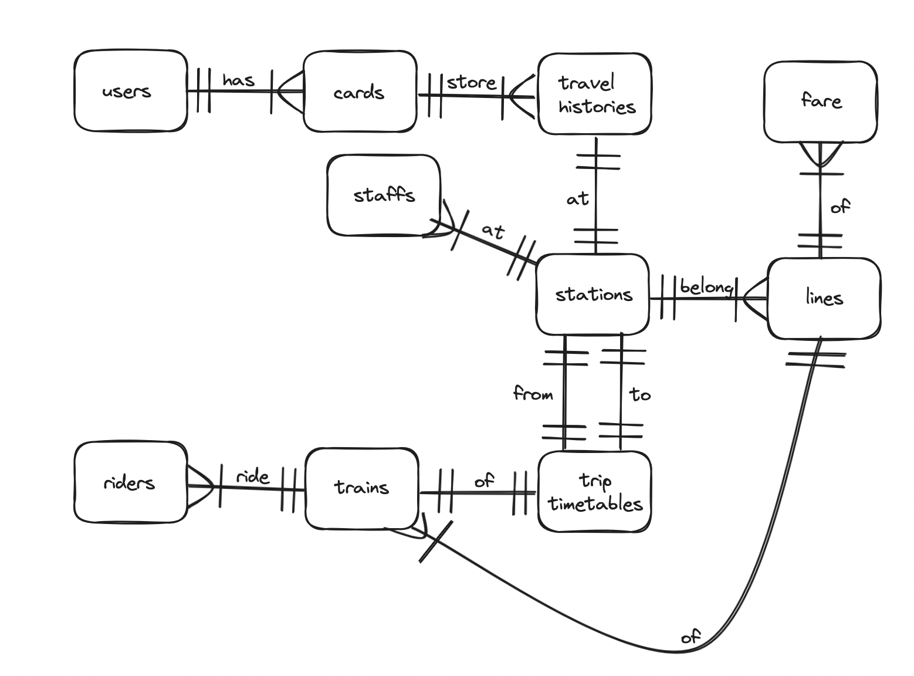

# CS50SQL: MRT Database

- **Project's title**: MRT Database
- **Video URL**: [CS50SQL: MRT database](https://youtu.be/oHj_i0YbhBk) (Recorded at: 30/02/2024)

## Scope

The purpose of the database is to store all data related to the **MRT system**, including information about stations, lines, trains, staff, riders, users, cards, travel histories, and the MRT schedule. However, it does not include information about cases where people purchase a pass card for **one-time usage** on the MRT.

In my previous final project for CS50P, I focused on **MRT Assistance**. This project has inspired me to create a demo of **MRT database**.

## Functional Requirements

Users can perform the following actions:

1. **Users**: Individuals who own MRT cards

    - List all users
    - Display the number of users group by age
    - Retrieve user details
    - Create a new user
    - Update user information
    - Delete a user

2. **Cards**: MRT cards belonging to users
    - List all MRT cards
    - Retrieve MRT card details
    - Create a new MRT card for a user
    - Update MRT card details (e.g. balance)
    - Delete an MRT card

3. **Travel Histories**: Records of travel associated with MRT cards
    - List all travel histories for MRT cards
    - Add a travel history to an MRT card

4. **Stations**: MRT stations
    - List all stations on a specific line (e.g. BL line)
    - Add new stations
    - Update station details (e.g., station name)
    - Delete a station

5. **Lines**: a specific route or track that trains follow.
    - List all lines
    - Add a new line
    - Delete a line

6. **Trip Timetables**: Schedules for departures and arrivals at stations
    - List all schedule timetables
    - Create new schedule timetables

7. **Trains**: the vehicles that run on the tracks of the MRT network
    - List all trains on a specific line
    - Create a new train
    - Delete a train based on its number

8. **Riders**: Individuals who ride the train
    - List all riders for a given train number
    - Create a new rider
    - Update rider details
    - Delete a rider

9. **Staffs**: Personnel working with the MRT system
    - List all staff (including riders)
    - Display the number of individuals working in specific roles
    - Create new staff
    - Update staff details (e.g., staff role)
    - Delete staff

10. **Fares**: Price for trips based on the number of stations traveled
    - List all fare prices ordered by the number of stations
    - Retrieve the fare price for a given number of stations
    - Create new fare prices for specific lines
    - Update fare prices for a specific line and number of stations

## Representation

### Entities

1. **users**: Individuals who own MRT cards
    - `id`: INTEGER
    - `national_id`: TEXT
    - `first_name`: TEXT
    - `last_name`: TEXT
    - `age`: INT

    I chose to apply the **UNIQUE** constraint to the `national_id` field as it serves as a unique identifier for individuals in Thailand. The national ID must consist of exactly 13 digits to adhere to the required format.

    I have set the `age` field to be an **INTEGER** and must be  **greater than or equal to 0** since age cannot be expressed as a negative number.

2. **cards**: : MRT cards belonging to users
    - `id`: INTEGER
    - `user_id`: INTEGER
    - `number`: TEXT
    - `type`: TEXT
    - `money`: INTEGER

    The `user_id` field has a **FOREIGN KEY** relationship with the id field in the Users table. I've chosen the ON DELETE action to be **SET NULL**. This means that if I delete a user, the user_id associated with that card will be set to NULL.

    I've chosen the **UNIQUE** constraint for the (card) `number` because each MRT card's number must be unique, serving as the card's identifier. The card number is required to have **8 digits**.

    I've categorized the MRT card into three `types`: **student**, **adult**, and **senior**. The card type depends on the _user's age_. These card types determine **the discount** applied to the fare price.

    | Card type | Percent of Discont |
    | --- | ---|
    | student | 10% |
    | adult | 0% |
    | senior | 50% |

    The `money` refers to the _remaining balance_ on the card, which must be **greater than or equal to 0** since money cannot be a negative number.

3. **travel_histories**: Records of travel associated with MRT cards
    - `id`: INTEGER
    - `card_id`: INTEGER
    - `station_id`: INTEGER
    - `action`: TEXT
    - `timestamp`: NUMERIC

    The `card_id` is a **FOREIGN KEY** relationship with the ID field in the Cards table, set with ON DELETE **CASCADE**. This means that if a card is deleted, all travel histories related to that card will also be deleted.

    The `station_id` is a **FOREIGN KEY** relationship with the ID field in the Stations table, configured with ON DELETE **NO ACTION**. This means that if a station is deleted, no action will be taken.

    The `action` field stores **TEXT**, limited to only **"entry"** and **"exit"**. This field records whether a person taps into the station (entry) or taps out (exit). With this data, we can determine the starting and ending stations of a user's trip and calculate the number of stations traveled.

4. **stations**: MRT stations
    - `id`: INTEGER
    - `line_id`: INTEGER
    - `number`: TEXT
    - `name`: TEXT

    The `line_id` is a **FOREIGN KEY** relationship with the ID field in the Lines table, configured with ON DELETE **RESTRICT**. This means it will restricts us from deleting line IDs when the foreign key constraint is violated.

5. **lines**: a specific route or track that trains follow.
    - `id`: INTEGER
    - `code`: TEXT

    In the `code` attribute, this field stores **TEXT**, and the length of the code must be exactly **2 characters** and **UNIQUE**.

6. **trip_timetables**: Schedules for departures and arrivals at stations
    - `id`: INTEGER
    - `from_station_id`: INTEGER
    - `to_station_id`: INTEGER
    - `departure_time`: TEXT
    - `arrival_time`: TEXT

    The `from_station_id` attribute represents the _departure station_. This attribute establishes a **FOREIGN KEY** relationship with the ID field in the stations table, configured with **ON DELETE RESTRICT**.

    The `to_station_id` attribute represents the _arrival station_. This attribute establishes a **FOREIGN KEY** relationship with the ID field in the stations table, configured with **ON DELETE RESTRICT**.

    The `departure_time` attribute stores text in the format of _HH:MM:SS_.

    The `arrival_time` attribute stores text in the format of _HH:MM:SS_.

7. **trains**: the vehicles that run on the tracks of the MRT network
    - `id`: INTEGER
    - `line_id`: INTEGER
    - `number`: TEXT

    The `line_id` is a **FOREIGN KEY** relationship with the ID field in the Lines table, configured with ON DELETE **RESTRICT**.

    The `number` attribute represents the train number, and it must be **UNIQUE**.

8. **riders**: Individuals who ride the train
    - `id`: INTEGER
    - `train_id`: INTEGER
    - `first_name`: TEXT
    - `last_name`: TEXT

    The `train_id` attribute represents the train being ridden by the rider. This attribute establishes a **FOREIGN KEY** relationship with the ID field in the trains table, configured with **ON DELETE RESTRICT**.

9. **staffs**: Personnel working with the MRT system
    - `id`: INTEGER
    - `work_at_station_id`: INTEGER
    - `first_name`: TEXT
    - `last_name`: TEXT
    - `role`: TEXT

    The `work_at_station_id` attribute represents the station that staff working at. This attribute establishes a **FOREIGN KEY** relationship with the ID field in the Stations table, configured with **ON DELETE RESTRICT**.

10. **fares**: Price for trips based on the number of stations traveled
    - `id`: INTEGER
    - `line_id`: INTEGER
    - `number_of_station`: INTEGER
    - `cost`: INTEGER

    The `line_id` is a **FOREIGN KEY** relationship with the ID field in the Lines table, set with **ON DELETE CASCADE**. This means that if a line is deleted, all fares related to that line will also be deleted.

### Entity Relationship Diagram

**Users** can own **MRT cards**. The MRT cards will store the **travel histories** of the card. In the travel histories, they will store the station where the card is tapped. The MRT will have **stations** where users enter or exit the MRT station. A **line** represents a specific route or track that trains follow. The **trip timetable** represents the schedule of arrival and departure times of the train. The **train** is the vehicle used for transporting users, and trains are ridden by **riders**. The **staff** are the personnel who work with the MRT. The **fare** is the price that users need to pay based on the number of stations and which line they use.

## Optimizations

### Indexes
I create the following indexes to improve optimizations:

- `user_index`: improves performance when searching for **national IDs** in the **users** table.
- `card_number_index`: improves performance when searching for **card numbers** in the **cards** table.
- `line_code_index`: improves performance when searching for **codes** in the **lines** table.
- `train_number_index`: improves performance when searching for **numbers** in the **trains** table.
- `staff_fname_index`: improves performance when searching for **first names** in the **staffs** table.
- `staff_lname_index`: improves performance when searching for **last names** in the **staffs** table.
- `rider_fname_index`: improves performance when searching for **first names** in the **rider** table.
- `rider_lname_index`: improves performance when searching for **last names** in the **rider** table.

### Views

- `mrt_staffs`: I created this view to simplify all staff of MRT systems, including riders.
- `mrt_cards`: I created this view to simplify MRT cards and also represent the owner of each card.

## Limitations

- Cannot calculate the fare of each trip when a user taps out (exit).
- Cannot deduct the balance from the card when a user taps out.
- Doesn't support soft deletion of users or staff.
- Only supports users who own the card.
